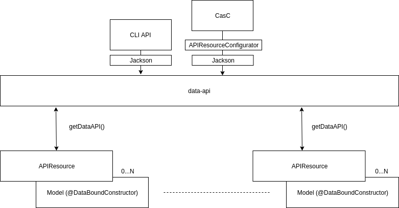

= JEP-0000: Data API
:toc: preamble
:toclevels: 3
ifdef::env-github[]
:tip-caption: :bulb:
:note-caption: :information_source:
:important-caption: :heavy_exclamation_mark:
:caution-caption: :fire:
:warning-caption: :warning:
endif::[]

.Metadata
[cols="2"]
|===
| JEP
| 0000

| Title
| Data API

| Sponsor
| https://github.com/amuniz[Antonio Muñiz]

// Use the script `set-jep-status <jep-number> <status>` to update the status.
| Status
| Not Submitted :information_source:

| Type
| Standards

| Created
| 2018-06-20
//
//
// Uncomment if there is an associated placeholder JIRA issue.
//| JIRA
//| :bulb: https://issues.jenkins-ci.org/browse/JENKINS-nnnnn[JENKINS-nnnnn] :bulb:
//
//
// Uncomment if there will be a BDFL delegate for this JEP.
//| BDFL-Delegate
//| :bulb: Link to github user page :bulb:
//
//
// Uncomment if discussion will occur in forum other than jenkinsci-dev@ mailing list.
//| Discussions-To
//| :bulb: Link to where discussion and final status announcement will occur :bulb:
//
//
// Uncomment if this JEP depends on one or more other JEPs.
| Requires
| :bulb: JEP-0000-1 :bulb:
//
//
// Uncomment and fill if this JEP is rendered obsolete by a later JEP
//| Superseded-By
//| :bulb: JEP-NUMBER :bulb:
//
//
// Uncomment when this JEP status is set to Accepted, Rejected or Withdrawn.
//| Resolution
//| :bulb: Link to relevant post in the jenkinsci-dev@ mailing list archives :bulb:

|===


== Abstract

Jenkins does not provide a homogeneous, user friendly and easy use representation of its stored data.

Existent data exposers use their own view of the data model (including configuration data stored by Jenkins), some of them
use the model directly (i.e. `get-job` CLI) and others return an arbitrary representation of the model (i.e. `list-credentials`
from _credentials-plugin_, which returns a plain text representation of credentials).

Main contributor to this problem is a **non-existent API to properly create a Resources layer to be exposed**.

This JEP is introducing that new API to guide developers to write that resources layer (also called DTO layer in some other literature).

== Specification

Main goals:

. Isolate Model from public API: introduce a new _Resources layer_ based on new APIs (in advance the _Data API_)
that can be leveraged for any data exposure (CLI and WS initially). It brings flexibility and improved
API UX for CLI/WS users and developers.
. Model can evolve whilst keeping backward compatibility in the Resources layer and Resources can
transform, map or simplify the real model to adapt it for consumers.
. The new _Data API_ is decoupled from Jenkins CLI and/or REST endpoints: the way to expose data is not a responsibility of the data itself.
(other JEPs are coming for that).
. API messages are versioned (note the "version" attribute in messages) for easier evolution and correct handling of breaking changes.
. Why _Data API_? Because this JEP focuses on data access (Create, Read, Update and Delete of any Jenkins stored model
using homogeneous access regardless the interface used for it).
. The _Data API_ will provide a mechanism to generate and parse JSON messages using `@Symbol` from the structs-plugin, so messages will look like:
```
{
  version: 1,
  data:[{
    "id": "github-key",
    "type": "sshPrivateKey"
    "scope": "GLOBAL",
    "description": "GitHub checkout key",
    "username": "john.doe",
    "privateKey": "<redacted>",
    "passphrase": "<redacted>"
  }]
}
```
Note the `type` attribute, which is defined in the resource class as:
```
@Symbol("sshPrivateKey")
public class SSHPrivateKeyResource extends APIResource
```
The `type` parameter is used for deserialization too, which avoids most of the security problems inherent to deserialization libraries (ie. Jackson),
as no arbitrary class can be instantiated during deserialization.

Also note the "version" attribute. It is added by the API to all messages (the real message payload goes into `data`).
This version attribute can be used to handle backward incompatible changes in the API. It would be initially `version: 1`
in all messages. This attribute is handled by the API itself and will be used to accomodate potentially imcompatible changes
in the part of the message generated by the API. In other words, content under the `data` attribute (generated by extensions of the API)
is not subject to the `version` attribute.

Next image shows the components involved in a common use of the Data API.
`APIResource` represents the Resouces layer which isolates Model from data exposure APIs (HTTP, CLI, Configuration as Code, ...).
`Model` boxes represent the existing model which is using traditional `@DataBoundConstructor` and `@DataBoundSetter` annotations.
`data-api-plugin` is the plugin providing the interoperability layer for consumers (it contains all needed APIs and
tooling for both sides, consumer and model).



Any data model is commonly highly polimorphic, and Jenkins data model is it too. A model entity (think of a `Credentials` object, for example) can have different representations depending
on the installed plugins (which can add credentials types). This polimorphism needs to reflect on the Data API endpoints, where a single endpoint
must be able to serialize any form of the base entity (an `APIResource` at this layer).
In this proposal that is handled as long as leafs elements on the model hierarchy implement `APIExportable#getDataAPI()`, so a call
to that method in the top level entity (`Credentials`, in the example) will get the actual `APIResource` mapping the child model,
then the serialization framework will do the rest (as it introspect the object to be serialized).

=== How does this work for plugin developers?

There is a PoC using the credentials plugin in a section below. But let's see how the implementation would be in a simpler case.

Given this initial model:

```
public class MyModel {

    private String foo;

    @DataBoundConstructor
    public MyModel(String foo) {
        this.foo = foo;
    }

    public String getFoo() {
        return foo;
    }

    public void setFoo(String foo) {
        this.foo = foo;
    }

}
```

To define the Resource for that specific model:

```
public class MyModel implements APIExportable {

    private String foo;

    @DataBoundConstructor
    public MyModel(String foo) {
        this.foo = foo;
    }

    public String getFoo() {
        return foo;
    }

    public void setFoo(String foo) {
        this.foo = foo;
    }

    @Override
    public MyModelResource getDataAPI() {
        return new MyModelResource(this);
    }

    @Symbol("mymodel")
    public static final class MyModelResource extends APIResource {

        private String foo;

        MyModelResource(MyModel model) {
            foo = model.getFoo();
        }

        public String getFoo() {
            return foo;
        }

        @Override
        public MyModel toModel() {
            return new MyModel(foo);
        }
    }
}
```

A hypothetical handler of this data would do something like:

```
MyModel model = service.get("id");
Serializer s = new Serializer();
String json = s.serialize(model.getDataAPI());
return ...
```

So a serialized form for a list of `MyModelResource` would look like:

```
{
  version: 1,
  data: [{
    type: "mymodel",
    foo: "foo"
  }, {
    type: "mymodel",
    foo: "bar"
  }]
}
```


== Motivation

There are currently three data handlers in Jenkins: CLI, HTTP API and Jenkins Configuration as Code (JCasC).

Each of them is potentially using different representations of the model, and some are using the model directly.
The practice has serious drawbacks:

* **Lack of flexibility in the API**: response messages are tied to the model (which is usually not suitable for external consumption).
Blue Ocean is an example, a whole new HTTP API was written because the built-in Jenkins one was not enough and there was no way to adapt it
without adapting the model too.
* **Heterogeneous data format**: there is no Java API to guide developers on what to return, so the current data exposure is a
mix of human readable format and XML/JSON/YAML of all colors.

== Reasoning

**The use of a resources layer instead of relying on model objects directly**. The alternative is "status quo", keep exposing the model through Stapler
and `doXX` methods (or `getDynamic` to be able to have path parameters).
There could be an objection on the proposed resources layer: there is more code to write to expose data and sometimes resource classes will
just mirror the model.
It is true, but in exchange there is a huge gain on flexibility and maintainability (the model can be modified freely whilst keeping the external data
API compatible).
. **Modernizing the tooling to write Data APIs**: this API layer will enable others to modernize by leveraging the new Resources.

Note that **migrating all existent HTTP API and CLI endpoints is not the goal of this JEP**.
This proposal is about providing and supporting a new way to expose data in Jenkins, to be used on new developments and **eventually migrate** existing
endpoints. So the existent HTTP API and CLI commands will coexist with the ones using this new API.

=== What about core model objects?

Ideally most of the new code should go into a new plugin (data-api-plugin), however some new interfaces will need to be created
in core in order to adapt core model objects in a way that extensions of that model can benefit of the new data-api features.

For example, `JobProperty` would need to extend `APIExportable` so any subclass of it can be properly serialized by
the data-api harness (as long as the subclass implements `APIExportable#getDataAPI()`).

== Backwards Compatibility

There are no backwards compatibility concerns related to this proposal.
Those model objects not implementing `APIExportable` will be just ignored (so they won't be included in data messages produced using the new layer).

Any existent data exposure mechanism will remain the same (ie. hudson.model.Api), this JEP is not interfering with that in any way.

== Security

There are no security risks related to this proposal.

== Infrastructure Requirements

There are no new infrastructure requirements related to this proposal.

== Testing

There are no testing issues related to this proposal.

== Prototype Implementation

A PoC has been written using the `credentials-plugin` as guinea pig.

Note that the `api` package in `credentials` would be finally placed under the new `data-api-plugin` and some basic interfaces should go to core.

* https://github.com/amuniz/credentials-plugin/pull/2/files[Credentials PoC]

There is also an integration PoC with JCasC. This integration shows how JCasC can use this new Resources layer as the schema of
configuration files.

* https://github.com/amuniz/configuration-as-code-plugin/pull/1

So, having all the PoC code in place **both credentials CLI and JCasC will be using the same payload data format**:

```
$> java -jar jenkins-cli.jar list-credentials system::system::jenkins --yaml

version: "1"
data:
- type: "domainCredentials"
  domain:
    type: "domain"
    name: "test.com"
    description: "test.com domain"
    specifications:
    - type: "hostnameSpec"
      includes: "*.test.com"
      excludes: ""
  credentials:
  - type: "usernamePassword"
    scope: "SYSTEM"
    id: "sudo_password"
    description: ""
    username: "root"
    password: "s3cr3t"
- type: "domainCredentials"
  credentials:
  - type: "certificate"
    scope: "SYSTEM"
    id: "ssh_private_key"
    description: ""
    password: "s2cr3t"
    file: "/docker/secret/id_rsa"

  - type: "sshPrivateKey"
    scope: "SYSTEM"
    id: "ssh_with_passprase"
    description: "SSH passphrase with private key file"
    username: "ssh_root"
    privateKeyFileOnMaster: "/docker/secret/id_rsa_2"
    passphrase: "s3cr3t"

  - type: "sshPrivateKey"
    scope: "SYSTEM"
    id: "ssh_with_passprase_provided"
    description: "SSH passphrase with private key file. Private key provided"
    username: "ssh_root"
    privateKey: "<redacted>"
    passphrase: "s3cr3t"
```

And a JCasC configuration file would look like:

```
credentials:
  system:
    domainCredentials:
      - type: "domainCredentials"
        domain :
          type: "domain"
          name: "test.com"
          description: "test.com domain"
          specifications:
            - type: "hostnameSpec"
              includes: "*.test.com"
        credentials:
          - type:     "usernamePassword"
            scope:    SYSTEM
            id:       sudo_password
            username: root
            password: ${SUDO_PASSWORD}

      - type: "domainCredentials"
        credentials:
          - type: "certificate"
            scope:    SYSTEM
            id:       ssh_private_key
            password: ${SSH_KEY_PASSWORD}
            file: /docker/secret/id_rsa

          - type: "sshPrivateKey"
            scope: SYSTEM
            id: ssh_with_passprase
            username: ssh_root
            passphrase: ${SSH_KEY_PASSWORD}
            description: "SSH passphrase with private key file"
            privateKeyFileOnMaster: /docker/secret/id_rsa_2

          - type: "sshPrivateKey"
            scope: SYSTEM
            id: ssh_with_passprase_provided
            username: ssh_root
            passphrase: ${SSH_KEY_PASSWORD}
            description: "SSH passphrase with private key file. Private key provided"
            privateKey: ${SSH_PRIVATE_KEY}
```

As opposed to the current format (just to compare):

```
$> java -jar jenkins-cli.jar list-credentials system::system::jenkins

=================================================================================================
Domain                      (global)
Description
# of Credentials            3
=================================================================================================
Id                          Name
=========================== =====================================================================
ssh_private_key             Certificate
ssh_with_passprase          ssh_root (SSH passphrase with private key file)
ssh_with_passprase_provided ssh_root (SSH passphrase with private key file. Private key provided)
=================================================================================================

============================
Domain           test.com
Description      test.com domain
# of Credentials 1
============================
Id               Name
================ ===========
sudo_password    root/******
============================
```

The above output is just plain text, and JCasC (below) format is based on the Java structure of the actual model:

```
credentials:
  system:
    domainCredentials:
      - domain :
          name: "test.com"
          description: "test.com domain"
          specifications:
            - hostnameSpecification:
                includes: "*.test.com"
        credentials:
          - usernamePassword:
              scope:    SYSTEM
              id:       sudo_password
              username: root
              password: ${SUDO_PASSWORD}

      # global credentials
      - credentials:
          - certificate:
              scope:    SYSTEM
              id:       ssh_private_key
              password: ${SSH_KEY_PASSWORD}
              keyStoreSource:
                fileOnMaster:
                  keyStoreFile: /docker/secret/id_rsa
          - basicSSHUserPrivateKey:
              scope: SYSTEM
              id: ssh_with_passprase
              username: ssh_root
              passphrase: ${SSH_KEY_PASSWORD}
              description: "SSH passphrase with private key file"
              privateKeySource:
                FileOnMasterPrivateKeySource:
                  privateKeyFile: /docker/secret/id_rsa_2
          - basicSSHUserPrivateKey:
              scope: SYSTEM
              id: ssh_with_passprase_provided
              username: ssh_root
              passphrase: ${SSH_KEY_PASSWORD}
              description: "SSH passphrase with private key file. Private key provided"
              privateKeySource:
                directEntry:
                  privateKey: ${SSH_PRIVATE_KEY}
```

== References

N/A.
