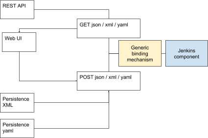

= JEP-0000: Data API
:toc: preamble
:toclevels: 3
ifdef::env-github[]
:tip-caption: :bulb:
:note-caption: :information_source:
:important-caption: :heavy_exclamation_mark:
:caution-caption: :fire:
:warning-caption: :warning:
endif::[]

.Metadata
[cols="2"]
|===
| JEP
| 0000

| Title
| Data API

| Sponsor
| https://github.com/amuniz[Antonio Muñiz]

// Use the script `set-jep-status <jep-number> <status>` to update the status.
| Status
| Not Submitted :information_source:

| Type
| Standards

| Created
| 2018-06-20
//
//
// Uncomment if there is an associated placeholder JIRA issue.
//| JIRA
//| :bulb: https://issues.jenkins-ci.org/browse/JENKINS-nnnnn[JENKINS-nnnnn] :bulb:
//
//
// Uncomment if there will be a BDFL delegate for this JEP.
//| BDFL-Delegate
//| :bulb: Link to github user page :bulb:
//
//
// Uncomment if discussion will occur in forum other than jenkinsci-dev@ mailing list.
//| Discussions-To
//| :bulb: Link to where discussion and final status announcement will occur :bulb:
//
//
// Uncomment if this JEP depends on one or more other JEPs.
| Requires
| :bulb: JEP-0000-1 :bulb:
//
//
// Uncomment and fill if this JEP is rendered obsolete by a later JEP
//| Superseded-By
//| :bulb: JEP-NUMBER :bulb:
//
//
// Uncomment when this JEP status is set to Accepted, Rejected or Withdrawn.
//| Resolution
//| :bulb: Link to relevant post in the jenkinsci-dev@ mailing list archives :bulb:

|===


== Abstract

Different parts of Jenkins provides different mechanisms to convert between in-memory object graphs and external structured data representations. As a result, plugin developers would have to deal with many of those. Some of more common conversion mechanisms are also brittle to the evolution of data model, and tend to produce accidental data representation, instead of encouraging plugin developers to design them.

This JEP introduces the new "Data API" that intends to act as an "universal" conversion mechanism.


== Specification
=== Data class
Data API introduces the notion of "data class", which is a Java class that participates in serialization. Data classes are written by plugin developers, and they opt into this. The opt-in avoids most of the security problems inherent to deserialization libraries (ie. Jackson), as no arbitrary class can be instantiated during deserialization.

A data class is repsented by a `DataModel`, which provides several key activities:

* *Serialization*: read/write instances to/from a tree representation
* *Schema*: how instances get represented in a tree representation needs to be deterministic without any instance of a model

`DataModel` does not dictate a specific databinding approach (or lack thereof.) Different `DataModel` implementations can introduce different databinding mechanisms, which is used to support existing databinding mechanisms, or brand new ones.

`DataModel` does, however, dictate the shape of a tree representation of a data class, basically to a map from names to values, where values can be primitives, data classe instances, or arrays of those. This expressiveness is in line with existing databinding mechanisms in Jenkins.

Protocol-wise, plugin developers designate a Java class as a data class by inserting an `DataModelFactory` extension. Most plugin developers, however, will likely use one of the available convenience mechanisms built on top of `DataModelFactory`.

=== Defining data class
In order to encourage uniformity, consistency, and convenience, Data API comes with several ready-made `DataModel` that establishes different conventions, and corresponding `DataModelFactory` hookup. Plugin developers are encouraged to use one of those. It should be a rare occurence to find a need for a full-scratch `DataModel`.

==== POJO data class
A POJO class can be designated as a data class with the `@DataClass` annotation, like this:

```
@DataClass @Symbol("apple")
public class Apple {// any POJO will do
  private String color;
  public void setColor(String color) {
    this.color = color;
  }
  public String getColor() {
    return color;
  }
}
```

Databinding will follow the Java Bean convention. If a `DataModel` is explicitly provided by other means, that takes precedence.

==== Describable as data class
For grandfathering existing widely-used component model, all `Describable` subtypes, which uses `@DataBoundConstructor` and `@DataBoundSetter`, automatically become data classes, through implicit backward-compatible `DataModel` whose tree representation is idencial to what Stapler has historically done for them. If a `DataModel` is explicitly provided by other means, that takes precedence:

```
public static class Cherry extends AbstractDescribableImpl<Cherry> {
    private String color;

    @DataBoundConstructor
    public Cherry(String color) {
        super("Cherry");
        this.color = c;
    }
    public String getColor() {
        return color;
    }
    @Extension @Symbol("cherry")
    public static final class DescriptorImpl extends FruitDescriptor {}
}
```

==== Custom data model
`CustomDataModel` is provided to allow the author of a data class to hand-author serialization code and associated schema, where such flexibility is necessary. For example, when dealing with complicated data evolution scenario.

The following example illustrates how to do this:

```
public class Banana {
    public boolean yellow;
    public Banana() {
    }
}

@Extension @Symbol("banana")
public static class BananaModel extends CustomDataModel<Banana> {
    public BananaModel() {
        super(Banana.class,
            // define schema by defining parameters
            parameter("ripe",boolean.class));
    }

    @Override
    public Mapping write(Banana object, DataContext context) {
        Mapping m = new Mapping();
        m.put("ripe",object.yellow);
        return m;
    }

    @Override
    public Banana read(Mapping input, DataContext context) throws IOException {
        Banaba b = new Banana();
        b.yellow = m.get("ripe").asBoolean();
        return b;
    }
}
```

A common technique is for a custom data model to partially delegate to other data model implementation, such as `PojoDataModel`, and do some pre/post processing on the tree representation.

The above sample also shows a convenience mechanism of defining a `DataModel` by delcaring itself as an extension. This mechanism can be used to override implicit `DataModel` used for `@DataClass` and `Describable` explained above.

==== DTO / in-memory class translation
In order to promote the idea of "designing the tree representation as the first class citizen," Data API provides another convention of defining data class, by using another POJO class as a data-transfer object (DTO) that faithfully represents the tree representation, and plugin developers manually providing translation between a data class and a DTO class.

Marker interfaces are used to guide plugin developers through the passage by turning convention errors into compilation errors. The split also allows in-memory class to evolve whilst keeping backward compatibility in the DTO layer and DTO can transform, map or simplify the in-memory model to adapt it for consumers.

Given this initial in-memory class,
```
public class MyModel {

    private String foo;

    public MyModel(String foo) {
        this.foo = foo;
    }

    public String getFoo() {
        return foo;
    }

    // all sorts of behaviours. not necessarily following POJO convention
}
```

To define the DTO class for that specific model:

```
public class MyModel implements APIExportable<MyModelResource> {

    private String foo;

    public MyModel(String foo) {
        this.foo = foo;
    }

    public String getFoo() {
        return foo;
    }

    @Override
    public MyModelResource toResource() {
        return new MyModelResource(this);
    }

    @Symbol("mymodel")
    public static final class MyModelResource extends APIResource {

        private String bar;

        MyModelResource(MyModel model) {
            bar = model.getFoo();
        }

        public MyModelResource() {}

        public String getBar() {
            return bar;
        }

        @Override
        public MyModel toModel() {
            return new MyModel(bar);
        }
    }
}
```

A hypothetical handler of this data would do something like:

```
MyModel model = new MyModel("Yo");
Serializer s = new JsonSerializer();
System.out.println(s.serialize(model);
```

So a serialized form for a list of `MyModelResource` would look like:

```
{
  version: 1,
  data: [{
    type: "mymodel",
    bar: "Yoo"
  }]
}
```

NOTE: now that I write it this way, not sure if terms like "Resource" or "API" are appropriate.


=== Format independence
In order to keep most of Data API independent from partiular data format such as JSON and YAML, a canonical representation of a tree structure is provided as `TreeNode` and 3 of its subypes:

* *Scalar*: primitive value like string, number, and boolean
* *Sequence*: a list of `TreeNode`
* *Mapping*: dictionary from names to `TreeNode`

`Serializer` is responsible for converting these from/to a textual representation of a specific format, such as JSON, YAML, and XML. It is possible, though not particularly encouraged, for plugin developers to define additional serializers.

=== Enveloping convention
(inheriting this from the original, though I haven't fully internalized why this is valuable enough to warrant addition)

Data API defines a convention to approach versioning so that different data classes and different callers of Data API provided consistent feel to users.

The first convention is enveloping, which adds the version number of Data API itself and will be used to accomodate potentially imcompatible changes
in the part of the message generated by the API.
```
{
  version: 1,
  data:{
    ... data object ...
  }
}
```
This format can be read as follows:
```
MyDataClass instance = new JsonSerializer().read(MyDataClass.class, new FileInputStream("my.json"));
```

Callers of Data API can choose to define its own enveloping scheme and provide the version number to the system:
```
{
  ... data object ...
}
```
```
instance = new JsonSerializer().read(1, MyDataClass.class, new FileInputStream("my.json"));
```

=== Data class versioning
Envelope version is a version of Data API, not a version of data classes. Data API defines a separate convention for versioning of data classes.

The goal of the convention is as follows:

* Allow Jenkins to reliably consume data produced by neighboring systems that produce data in an older format, even when incompatible changes occure.
* Allow neighboring systems that consume data from Jenkins to fail in a reliable way, when an incompatible change occurs.

Specifically, when a change occurs in the serialized format of a data class, we call it _compatible_ if the updated reader can still read everything produced by the older writer and achieve the same semantics AND the updated writer can produce data that can be still consumed by the older reader, possibly ignoring parameters.

The easiest example of this is adding a new optional parameter. The rew reader can consume everything written before, and the new writer produces data that can be still consumed by the older reader, though newly added properties will not be ignored. Removing an optional parameter is another example of a compatilbe change.

An example of incompatible change is to rename a mandatory parameter from "foo" to "bar." Even with a modified reader code to recognize the "foo" attribute, the older reader will not see required "foo" and fails.

An incompatible change should be discouraged, but if it needs to be made, Data API advocates for the model class to introduce the integer "version" parameter (that starts from 2, since 1 was the first implicit version) in its serialized form to designate the fact, and maintain the reader code capable of reading data marked with earlier versions.

The use of the "version" parameter for any other purpose is strongly discouraged.

=== Symbol
In order to encourage a tree representation accessible to humans, every data class has a short symbol name, similar to https://github.com/jenkinsci/structs-plugin/blob/master/annotation/src/main/java/org/jenkinsci/Symbol.java[the `@Symbol` annotation], controlled by `DataModel`.

This symbol name is used to represent the polymorphism, a common idiom of data model design in Jenkins, where one data class defines a property of an extension point, which at runtime holds a reference to a concrete implementation of that extension point. See the example below,

```
@DataClass @Symbol("parent")
public class Parent {
  private Child child;
  public void setChild(Child child) {
    this.child = child;
  }
  public Child getChild() {
    return child;
  }
}
@DataClass
public abstract class Child {}
@DataClass @Symbol("boy")
public class Boy extends Child {}
@DataClass @Symbol("girl")
public class Girl extends Child {}
```

Most `DataModel` implementations determine the name by looking up the `@Symbol` annotation on relevant classes. Just like the `@Symbol` annotation, a symbol name is not globally unique, and instead is unique only within the context of specific base extension type.

Data API reserves the `type` attribute to record the symbol information. For example, serializing a `Parent` in an envelope might produce something like the following:
```
{
  version: 1,
  data:{
    type: parent,
    child: {
      type: boy
    }
  }
}
```

=== Subsuming existing systems
This section discusses parts of Data API primarily meant for backward compatibility with existing databinding mechanisms that Data API aims to replace.

==== Compatibility with Stapler form binding
<< TBD >>

==== Compatibility with Pipeline (aka "structs")
<< TBD >>

==== Compatibility with CasC
<< TBD >>


== Motivation
=== 14 different standards
Jenkins ecosystem has many mechanisms to convert in-memory object graphs to external structured data representations:

* Stapler form binding that takes JSON and does data-binding via `@DataBound` annotations, used for config form submissions
* `structs` plugin that somewhat duplicates the above, used by Pipeline
* `configuration-as-code` plugin that somewhat duplicates the above, used by CasC
* Direct use of Jackson, for example can be seen in Blue Ocean
* XML serialization via XStream, used for persisting data and config to $JENKINS_HOME
* Stapler object graph traversal, driven by `@Export` annotations, used for the '/api' "REST" API

Those implementations are all pretty comparable, being driven by metadata from Java model. They all deal with similar concerns, such as converting arbitrary graph into a tree, backward compatibility, data evolution, and so on.

We want the conversation mechanism that works more universally. Practically speaking, it might not fully replace everything in the above list, but we want it to replace several of those, and prevent more from being developed in the future.



=== Plugin developer burden
Plugin developers regularly need to support those multiple databinding mechanisms, and this results in higher cognitive overhead, rooms for mistakes, and inconsistencies in different mechanisms. We want to reduce this.

=== Precise control for the syntax
Most of the conversion mechanisms used today rely on implicit databinding driven from the structure of Java class and annotations.

This is fine for simple things and early on, but over time, as the code and the data format evolves, the implicitness of the databinding gets in the way of precisely controlling the conversion behaviour.

=== Multiple data format support
From the "14 different standards" goal, it follows that we need to support multiple different data format, at least JSON, YAML, and XML.

Data API deals with the common subset of these data formats. Namely, maps, sequences, and scalars with limited datatypes. The goal is to allow components to serialize themselves into a composition of those, to be read back in. The resulting tree model needs to be approachable to humans, but it need not use every language feature available. For example, we don't use XML attributes.

=== Outlet independent
Also follows from the "14 different standards" goal is that Data API is meant to be used by different I/O systems and thus indifferent to how the tree representation is used.

For example, one use of Data API might build a set of CLIs, another might define a series of REST endpoints. The way to expose data is not a responsibility of the data itself nor Data API. Other JEPs are coming to define those subsystems.

=== Human accessible tree representation
<< TBD: don't be a dump format like XStream, be a human readable format like CasC >>


== Reasoning

=== Grandfather existing databinding
One of the lessons from CasC is that if we introduce a wholy new databinding mechanism, it will face a chicken and egg problem. No one wants to consume new API because no data classes support them, and no plugin developers care to update their classes to support new API because nobody consumes them.

If, OTOH, new API can pick up some of the existing databinding mechanism and leverage those, then new API instantly have tons of classes available for databinding, and new API can also replace that mechanism entirely.

For this purpose, an ideal existing mechanism to replace is one that's already widely in use, one that is bi-directional, one that uses a simple tree representation, and one that has limited simplistic databinding behaviour. From these criteria, we have chosen Stapler form binding, which is currently used to render config form in web UI, CasC, and Pipeline via the structs plugin.


=== Federation of databinding, not the one true databinding
Why don't we just use Jackson, JAXB, XStream, whatever and be done with it?

In order to grandfather existing databinding, Data API cannot pick one winning databinding solution and be done with it. We need to allow different data classes to do databinding differently instead, and compose the reult into one tree representation and back.

Another reasoning to avoid embracing one true databinding is the need to deal with a complicated data evolution scenario also calls for the ability to escape the databinding mechanism altogether, and instead to hand-author a serialization code.

This led to the `DataModel` design where every data class brings in its own data model and serialization behaviour, and Data API providing a number of convenient implementations and conventions.

It is conceivable, while not yet proven, to write a `DataModel` that uses existing databinding libraries like Jackson.

=== Schema support
<< TBD. Pipeline and CasC needs this >>

=== Why Data API is in core?
<< TBD. Or maybe not >>

NOTE: I'm thinking the contract part will go to Stapler, extensions and discovery will go to core, and possibly some utilities in a library plugin?

Ideally most of the new code should go into a new plugin (data-api-plugin), however some new interfaces will need to be created
in core in order to adapt core model objects in a way that extensions of that model can benefit of the new data-api features.

For example, `JobProperty` would need to extend `APIExportable` so any subclass of it can be properly serialized by
the data-api harness (as long as the subclass implements `APIExportable#getDataAPI()`).


=== Peril of implicit databinding of in-memory object
**The use of a DTO layer instead of relying on model objects directly**. The alternative is "status quo", keep exposing the model through Stapler
and `doXX` methods (or `getDynamic` to be able to have path parameters).
There could be an objection on the proposed resources layer: there is more code to write to expose data and sometimes resource classes will
just mirror the model.
It is true, but in exchange there is a huge gain on flexibility and maintainability (the model can be modified freely whilst keeping the external data
API compatible).

**Modernizing the tooling to write Data APIs**: this API layer will enable others to modernize by leveraging the new Resources.


== Backwards Compatibility
<< TBD >>

* Data API replaces Stapler form binding
* Data API aims to replace structs plugin but that's opt-in

== Security
<< TBD >>

* Opt-in behaviour of Data API helps with the security

== Infrastructure Requirements

There are no new infrastructure requirements related to this proposal.

== Testing
<< TBD >>

* replacing Stapler form binding touches a lot of things. For a while we should keep the legacy databinding code and expose this slowly.

== Prototype Implementation

The current version of prototype:

* https://github.com/jenkinsci/jenkins/tree/data-api/core/src/main/java/jenkins/data[PoC in core] and https://github.com/jenkinsci/jenkins/blob/data-api/test/src/test/java/hudson/cli/SampleDataCLITest.java[samples in test]

This PoC is an iteration of the previous round of prototype, which has been written using the `credentials-plugin` as guinea pig. Note that the `api` package in `credentials` represents Data API, which would move to the new `data-api-plugin` and some basic interfaces should go to core.

* https://github.com/amuniz/credentials-plugin/pull/2/files[Credentials PoC]

There is also an integration PoC with JCasC. This integration shows how JCasC can use this new Resources layer as the schema of
configuration files.

* https://github.com/amuniz/configuration-as-code-plugin/pull/1

So, having all the PoC code in place **both credentials CLI and JCasC will be using the same payload data format**:

```
$> java -jar jenkins-cli.jar list-credentials system::system::jenkins --yaml

version: "1"
data:
- type: "domainCredentials"
  domain:
    type: "domain"
    name: "test.com"
    description: "test.com domain"
    specifications:
    - type: "hostnameSpec"
      includes: "*.test.com"
      excludes: ""
  credentials:
  - type: "usernamePassword"
    scope: "SYSTEM"
    id: "sudo_password"
    description: ""
    username: "root"
    password: "s3cr3t"
- type: "domainCredentials"
  credentials:
  - type: "certificate"
    scope: "SYSTEM"
    id: "ssh_private_key"
    description: ""
    password: "s2cr3t"
    file: "/docker/secret/id_rsa"

  - type: "sshPrivateKey"
    scope: "SYSTEM"
    id: "ssh_with_passprase"
    description: "SSH passphrase with private key file"
    username: "ssh_root"
    privateKeyFileOnMaster: "/docker/secret/id_rsa_2"
    passphrase: "s3cr3t"

  - type: "sshPrivateKey"
    scope: "SYSTEM"
    id: "ssh_with_passprase_provided"
    description: "SSH passphrase with private key file. Private key provided"
    username: "ssh_root"
    privateKey: "<redacted>"
    passphrase: "s3cr3t"
```

And a JCasC configuration file would look like:

```
credentials:
  system:
    domainCredentials:
      - type: "domainCredentials"
        domain :
          type: "domain"
          name: "test.com"
          description: "test.com domain"
          specifications:
            - type: "hostnameSpec"
              includes: "*.test.com"
        credentials:
          - type:     "usernamePassword"
            scope:    SYSTEM
            id:       sudo_password
            username: root
            password: ${SUDO_PASSWORD}

      - type: "domainCredentials"
        credentials:
          - type: "certificate"
            scope:    SYSTEM
            id:       ssh_private_key
            password: ${SSH_KEY_PASSWORD}
            file: /docker/secret/id_rsa

          - type: "sshPrivateKey"
            scope: SYSTEM
            id: ssh_with_passprase
            username: ssh_root
            passphrase: ${SSH_KEY_PASSWORD}
            description: "SSH passphrase with private key file"
            privateKeyFileOnMaster: /docker/secret/id_rsa_2

          - type: "sshPrivateKey"
            scope: SYSTEM
            id: ssh_with_passprase_provided
            username: ssh_root
            passphrase: ${SSH_KEY_PASSWORD}
            description: "SSH passphrase with private key file. Private key provided"
            privateKey: ${SSH_PRIVATE_KEY}
```

As opposed to the current format (just to compare):

```
$> java -jar jenkins-cli.jar list-credentials system::system::jenkins

=================================================================================================
Domain                      (global)
Description
# of Credentials            3
=================================================================================================
Id                          Name
=========================== =====================================================================
ssh_private_key             Certificate
ssh_with_passprase          ssh_root (SSH passphrase with private key file)
ssh_with_passprase_provided ssh_root (SSH passphrase with private key file. Private key provided)
=================================================================================================

============================
Domain           test.com
Description      test.com domain
# of Credentials 1
============================
Id               Name
================ ===========
sudo_password    root/******
============================
```

The above output is just plain text, and JCasC (below) format is based on the Java structure of the actual model:

```
credentials:
  system:
    domainCredentials:
      - domain :
          name: "test.com"
          description: "test.com domain"
          specifications:
            - hostnameSpecification:
                includes: "*.test.com"
        credentials:
          - usernamePassword:
              scope:    SYSTEM
              id:       sudo_password
              username: root
              password: ${SUDO_PASSWORD}

      # global credentials
      - credentials:
          - certificate:
              scope:    SYSTEM
              id:       ssh_private_key
              password: ${SSH_KEY_PASSWORD}
              keyStoreSource:
                fileOnMaster:
                  keyStoreFile: /docker/secret/id_rsa
          - basicSSHUserPrivateKey:
              scope: SYSTEM
              id: ssh_with_passprase
              username: ssh_root
              passphrase: ${SSH_KEY_PASSWORD}
              description: "SSH passphrase with private key file"
              privateKeySource:
                FileOnMasterPrivateKeySource:
                  privateKeyFile: /docker/secret/id_rsa_2
          - basicSSHUserPrivateKey:
              scope: SYSTEM
              id: ssh_with_passprase_provided
              username: ssh_root
              passphrase: ${SSH_KEY_PASSWORD}
              description: "SSH passphrase with private key file. Private key provided"
              privateKeySource:
                directEntry:
                  privateKey: ${SSH_PRIVATE_KEY}
```

== References

N/A.
