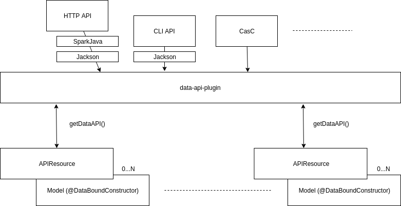

= JEP-0000: Data API
:toc: preamble
:toclevels: 3
ifdef::env-github[]
:tip-caption: :bulb:
:note-caption: :information_source:
:important-caption: :heavy_exclamation_mark:
:caution-caption: :fire:
:warning-caption: :warning:
endif::[]

.Metadata
[cols="2"]
|===
| JEP
| 0000

| Title
| Data API

| Sponsor
| https://github.com/amuniz[Antonio Muñiz]

// Use the script `set-jep-status <jep-number> <status>` to update the status.
| Status
| Not Submitted :information_source:

| Type
| Standards

| Created
| 2018-06-20
//
//
// Uncomment if there is an associated placeholder JIRA issue.
//| JIRA
//| :bulb: https://issues.jenkins-ci.org/browse/JENKINS-nnnnn[JENKINS-nnnnn] :bulb:
//
//
// Uncomment if there will be a BDFL delegate for this JEP.
//| BDFL-Delegate
//| :bulb: Link to github user page :bulb:
//
//
// Uncomment if discussion will occur in forum other than jenkinsci-dev@ mailing list.
//| Discussions-To
//| :bulb: Link to where discussion and final status announcement will occur :bulb:
//
//
// Uncomment if this JEP depends on one or more other JEPs.
//| Requires
//| :bulb: JEP-NUMBER, JEP-NUMBER... :bulb:
//
//
// Uncomment and fill if this JEP is rendered obsolete by a later JEP
//| Superseded-By
//| :bulb: JEP-NUMBER :bulb:
//
//
// Uncomment when this JEP status is set to Accepted, Rejected or Withdrawn.
//| Resolution
//| :bulb: Link to relevant post in the jenkinsci-dev@ mailing list archives :bulb:

|===


== Abstract

[TIP]
====
Give a short (200 word) description of the technical issue addressed.
====

Jenkins does not provide a homogeneous, easy to understand and easy use external API
(through CLI and HTTP) to manage Jenkins data.

Main contributions to this problem are: **lack of a real Resources API to be exposed** (raw model objects and sometimes
just human readable text is returned nowadays), and **outdated and limited tooling** (CLI and HTTP APIs serialization
is based on Stapler and Stapler annotations).

This JEP is introducing both a new set of APIs to guide developers to write better external APIs and bringing
new tooling to easily define the Resources layer to be exposed, as well as modern ways to build an HTTP/REST API.

== Specification

[TIP]
====
Provide a detailed specification what is being proposed.
Be as technical and detailed as needed to allow new or existing Jenkins developers
to reasonably understand the scope/impact of an implementation.
====

Main goals:

. Isolate Model from public API: introduce a new _Resources layer_ based on new APIs (in advance the _Data API_)
that can be leveraged for any data exposure (CLI and WS initially). It brings flexibility and improved
API UX for CLI/WS users and developers.
. Model can evolve whilst keeping backward compatibility in the Resources layer and Resources can
transform, map or simplify the real model to adapt it for consumers.
. The new _Data API_ is decoupled from Jenkins CLI and/or REST endpoints: the way to expose data is not a responsibility of the data itself.
(However, this JEP also includes a proposal to expose data coming from the Data API through an HTTP API)
. API messages are versioned (note the "version" attribute in messages) for easier evolution and correct handling of breaking changes.
. Modernize Jenkins: using https://github.com/FasterXML/jackson[Jackson] instead of Stapler to define
and run serialization and http://sparkjava.com/[Spark] to define/expose the HTTP API.
. Why _Data API_? Because this JEP focuses on data access (Create, Read, Update and Delete of any Jenkins stored model
using homogeneous access regardless the public interface used for it).
. The _Data API_ will provide a mechanism to generate and parse JSON messages using `@Symbol` from the structs-plugin, so messages can look like:
```
{
    "id": "github-key",
    "type": "sshPrivateKey"
    "scope": "GLOBAL",
    "description": "GitHub checkout key",
    "username": "john.doe",
    "privateKey": "<redacted>",
    "passphrase": "<redacted>"
}
```
Note the `type` attribute, which is defined in the resource class as:
```
@Symbol("sshPrivateKey")
public class SSHPrivateKeyResource extends APIResource
```
The `type` parameter is used for deserialization too.

Next image shows the components involved in a common use of the Data API.
`APIResource` represents the Resouces layer which isolates Model from data exposure APIs (HTTP, CLI, Configuration as Code, ...).
`Model` boxes represent the existing model which is using the traditional `@DataBoundConstructor` (and `@DataBoundSetters`).
`data-api-plugin` is the plugin providing the interoperability layer for consumers (it contains all needed APIs and
tooling for both sides, consumer and model).



== Motivation

[TIP]
====
Explain why the existing code base or process is inadequate to address the problem that the JEP solves.
====

There are currently two ways to expose data outside Jenkins: CLI and HTTP API.
Both APIs do not guide developers on what to return and the tooling to implement them is obsolete and limited.
Traditionally Jenkins developers have returned a serialized form of raw Jenkins model objects. The practice has serious drawbacks:

* **Lack of flexibility in the API**: response messages are tied to the model (which is usually not suitable for external consumption).
Blue Ocean is an example, a whole new HTTP API was written because the built-in Jenkins one was not enough and there was no way to adapt it
without adapting the model too.
* **Heterogeneous data format**: there is no Java API to guide developers on what to return, so the current public CLI and HTTP API is a
mix of human readable format and XML of all colors.
* **Outdated serialization tooling**: model is serialized by Stapler and based on old and limited Stapler annotations.
* **Outdated REST API tooling**: The HTTP API is based on `hudson.model.Api` class which makes nearly impossible to write a proper REST API.

== Reasoning

[TIP]
====
Explain why particular design decisions were made.
Describe alternate designs that were considered and related work, e.g. how the feature is supported in other systems.
Provide evidence of consensus within the community and discuss important objections or concerns raised during discussion.
====

There are two main design decisions here:

. **The use of a resources layer instead of relying on model objects directly**. The alternative is "status quo", keep exposing the model through Stapler
and `doXX` methods (or `getDynamic` to be able to have path parameters).
There could be an objection on the proposed resources layer: there is more code to write to expose data and sometimes resource classes will
just mirror the model.
It is true, but in exchange there is a huge gain on flexibility and maintainability (the model can be modified freely whilst keeping the external data
API compatible).
. **Modernizing the tooling to write Data APIs** (introducing SparkJava and Jackson to expose the data). SparkJava is easy to use, simple, lightweight
and it evolves in a backward compatible way (they say in the documentation). Jackson is the de-facto standard tool to serialize/deserialize JSON nowadays.
Jackson and SparkJava would be the replacement for Stapler when writing HTTP APIs.

Note that **migrating all existent HTTP API and CLI endpoints is not the goal of this JEP**.
This proposal is about providing and supporting a new way to expose data in Jenkins, to be used on new developments and **eventually migrate** existing
endpoints. So the existent HTTP API and CLI commands will coexist with the ones using this new API (which will be exposed under some specific
path for HTTP).

== Backwards Compatibility

[TIP]
====
Describe any incompatibilities and their severity.
Describe how the JEP proposes to deal with these incompatibilities.
If there are no backwards compatibility concerns, this section may simply say:
There are no backwards compatibility concerns related to this proposal.
====

There are no backwards compatibility concerns related to this proposal.
Those model objects not implementing `APIExportable` will be just ignored (so they won't be included in data messages).

== Security

[TIP]
====
Describe the security impact of this proposal.
Outline what was done to identify and evaluate security issues,
discuss of potential security issues and how they are mitigated or prevented,
and how the JEP interacts with existing permissions, authentication, authorization, etc.
If this proposal will have no impact on security, this section may simply say:
There are no security risks related to this proposal.
====

There are no security risks related to this proposal.

== Infrastructure Requirements

[TIP]
====
Describing any impact on Jenkins project infrastructure.

Include any additions or changes, interactions with exiting components,
potential instabilities, service-level agreements,
and responsibilities for continuing maintenance.
Explain the scope of infrastructure changes with sufficient detail
to allow initial and on-going cost (in both time and money) to be estimated.
If this proposal will have no impact on infrastructure, this section may simply say:
There are no new infrastructure requirements related to this proposal.
====

There are no new infrastructure requirements related to this proposal.

== Testing

[TIP]
====
If the JEP involves any kind of behavioral change to code
(whether in a Jenkins product or backend infrastructure),
give a summary of how its correctness (and, if applicable, compatibility, security, etc.) can be tested.

In the preferred case that automated tests can be developed to cover all significant changes, simply give a short summary of the nature of these tests.

If some or all of changes will require human interaction to verify, explain why automated tests are considered impractical.
Then summarize what kinds of test cases might be required: user scenarios with action steps and expected outcomes.
Might behavior vary by platform (operating system, servlet container, web browser, etc.)?
Are there foreseeable interactions between different permissible versions of components (Jenkins core, plugins, etc.)?
Are any special tools, proprietary software, or online service accounts required to exercise a related code path (Active Directory server, GitHub login, etc.)?
When will testing take place relative to merging code changes, and might retesting be required if other changes are made to this area in the future?

If this proposal requires no testing, this section may simply say:
There are no testing issues related to this proposal.
====

There are no testing issues related to this proposal.

== Prototype Implementation

[TIP]
====
Link to any open source reference implementation of code changes for this proposal.
The reference implementation need not be completed before the JEP is <<accepted>>,
but must be completed before any JEP is given "Final" status.
JEPs which will not include code changes may omit this section.
====

A PoC has been written using the `credentials-plugin` and its extension `ssh-credentials-plugin`.

Note that the `api` package in `credentials` would be finally placed under the new `data-api-plugin`.

* Credentials PoC: https://github.com/jenkinsci/credentials-plugin/compare/master...amuniz:data-api
* SSH Credentials PoC: https://github.com/jenkinsci/ssh-credentials-plugin/compare/master...amuniz:data-api

== References

[TIP]
====
Provide links to any related documents.
This will include links to discussions on the mailing list, pull requests, and meeting notes.
====
